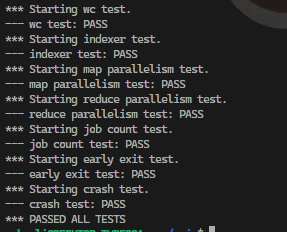

# Distributed MapReduce

A simple MapReduce implementation written in Go, developed as part of an Advanced Distributed Systems class assignment. This project is based on an MIT assignment and demonstrates distributed processing using two implementations: one with RPC and another with gRPC.

---

## Table of Contents

- [Overview](#overview)
- [Features](#features)
- [Project Structure](#project-structure)
- [Installation](#installation)
- [Usage](#usage)
- [Technologies Used](#technologies-used)
- [License](#license)

---

## Overview

This project implements a distributed MapReduce framework, showcasing the fundamentals of distributed computing. It processes large datasets by dividing tasks into map and reduce operations, distributed across multiple workers. The project includes two distinct implementations to explore both RPC and gRPC communication methods.

---

## Features

1. **RPC Implementation**:  
   A basic implementation of MapReduce using Go's built-in Remote Procedure Call (RPC) library.

2. **gRPC Implementation**:  
   An extended version utilizing gRPC for more robust and efficient communication.

3. **Distributed Task Management**:  
   Handles task distribution and fault tolerance across multiple workers.

---

## Project Structure

The implementation files are located in the `src/mr` folder.

- `src/mr`: Contains the core implementation of MapReduce using both RPC and gRPC.
- Other supporting files and configurations are also included in the `src` directory.

---

## Installation

To set up the project locally:

1. Clone the repository:

   ```bash
   git clone https://github.com/mohaali482/distributed-map-reduce.git
   cd distributed-map-reduce/src
   ```

2. Install dependencies:  
   Ensure you have Go installed on your system. Install required dependencies for gRPC:
   ```bash
   go mod tidy
   ```

---

## Usage

1. Navigate to the project directory:

   ```bash
   cd src/main
   ```

2. Run the tests MapReduce implementation:
   ```bash
   bash test-mr.sh
   ```

---

## Results



## Technologies Used

- **Programming Language**: Go
- **Communication Protocols**: RPC, gRPC

---

## License

This project is licensed under the MIT License. See the `LICENSE` file for more details.
